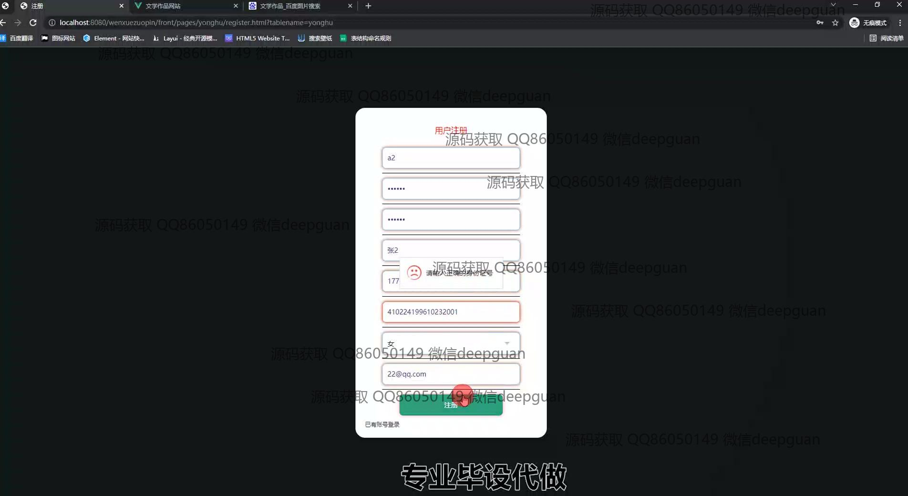
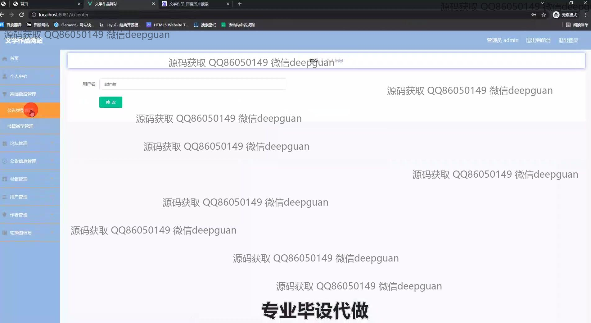
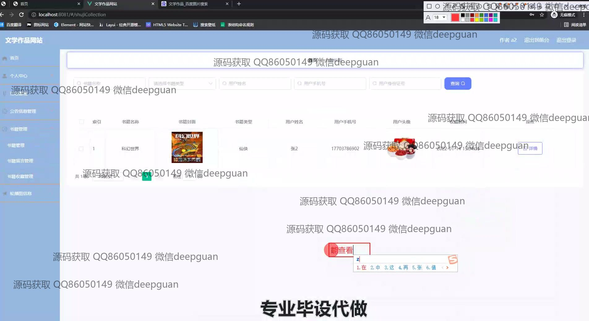

<h1 align="center">中国文学作品网站+vue</h1>

## 简介
中国文学作品网站：系统角色分为管理员和用户；功能包括用户登录、注册、个人中心管理、书籍管理、论坛互动、公告管理、书籍收藏、留言管理等，注重用户友好性和功能分区。    --计算机毕业设计源码；毕设源码；java毕业设计源码

## 联系方式

<h3 align="center">获取完整代码与数据库文件 + 微信：deepguan QQ: 86050149 QQ群: 783742310</h3>

<h3 align="center">可帮忙远程部署 包运行成功！提供远程部署、修改代码、设计文档指导、代码讲解等服务！</h3>

## 功能介绍（完整见运行截图）
管理员： 登录、注册、退出的基本功能。后台管理界面包括首页、个人中心、书籍管理、用户管理、论坛管理、公告管理、留言管理、轮播图管理等模块。能够发布公告、管理论坛帖子、编辑书籍信息、查看和回复用户留言。支持书籍的新增、修改、删除和排序操作，支持图片上传和文件管理。

用户： 提供登录、注册、退出的基本功能。网站首页展示推荐书籍、热门论坛帖子、公告信息等。用户可以通过搜索和浏览书籍列表查看详情并收藏，访问个人中心查看个人信息、管理收藏记录和修改资料。同时参与论坛互动，可以查看和回复帖子。

## 运行截图

本代码来源于网络,仅供学习参考使用!

